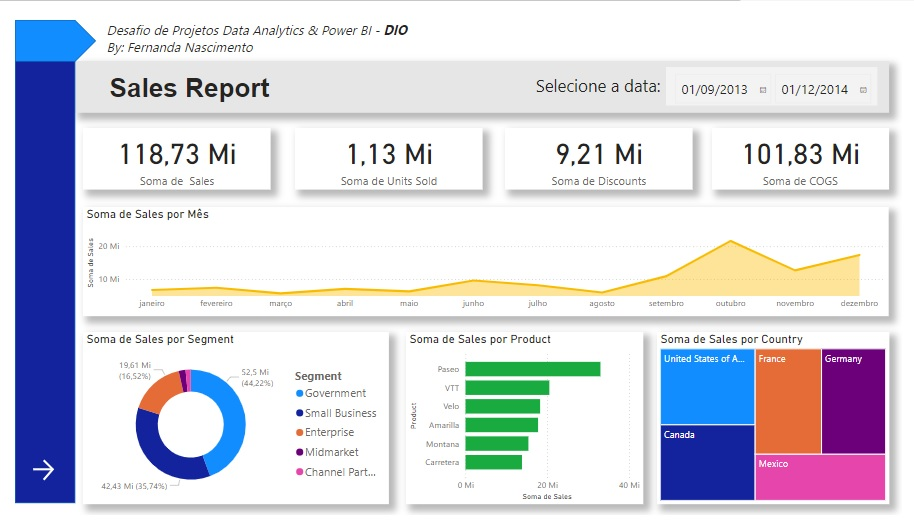
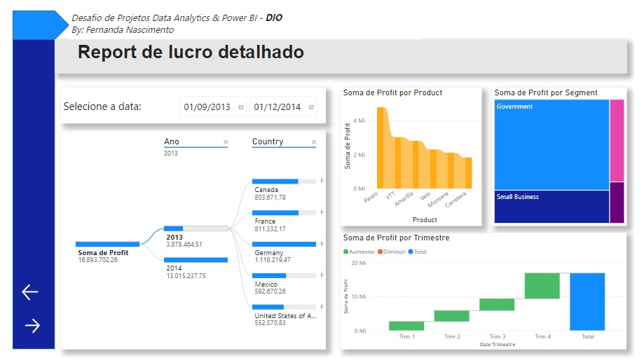
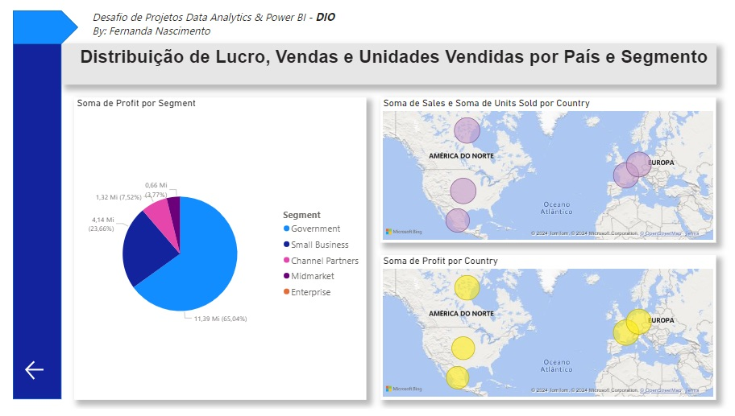

<h1 align="center">
    <a href="https://fernanda1701.github.io/desafio-data-analytics-e-power-bi/">Data Analytics & Power BI 📊</a>
</h1>

 <b>Desafio </b> de Projetos Data Analytics & Power BI da Sysvision na DIO

<h2 align="center">

</h2>

## 💎 Sobre

O projeto foi desenvolvido para a fixação de conhecimentos em <b><i>Análise de Dados</i></b> e <b><i>Power BI</i></b>.
O desafio era criar um Dashboard de 3 páginas a partir de uma tabela de vendas de produtos do <b>Excel</b>.

## 📖 Contexto

Foi disponibilizada uma sample onde foram criadas duas páginas do projeto em aula. Esse projeto será baseado nas duas páginas já criadas, porém com customizações pessoais, e será criada uma terceira página de própria autoria, nela devem conter alguns visuais:

- [x] Visual Mapa 1: Soma de Sales e Unidades Vendidas por País 
- [x] Visual Mapa 2: Soma de Lucro (Profit) por País 
- [x] Visual de Pizza: Lucro por Segmento 

 Esse desafio visa treinar a habilidade de criação de visuais obtendo, assim, familiaridade com esses recursos. 

 
 
## 📊 Visualização de Dados

Abaixo, teremos a demonstração das três páginas criadas:
 

<h3 align="center">Página 1</h3>

  

<h3 align="center">Página 2</h3>

  

<h3 align="center">Página 3</h3>

  

OBS: As páginas possuem navegação entre si, clicando nas "setinhas", podemos avançar ou retornar para a página anterior ou próxima página.

Para conferir o <b>Dashboard</b> 📊 no <i><b>Power BI</b></i> ➞ <a href="https://app.powerbi.com/groups/5e581924-1e97-4f0c-851f-f45ddfde7414/reports/909651c4-d466-47b2-98ea-95ef527444f8/75379c4e8b8234f9ae90?experience=power-bi">Clique aqui!</a>

## 🛠 Tecnologias
 
- [Power BI](https://www.microsoft.com/pt-br/power-platform/products/power-bi)
- [Excel](https://www.microsoft.com/pt-br/microsoft-365/excel)
- Versionamento de código no [Git](https://git-scm.com/)

## Autor:

<a href="https://github.com/Fernanda1701">
 
  
 <b>Fernanda Nascimento</b></a> 

Entre em contato ✉️:

